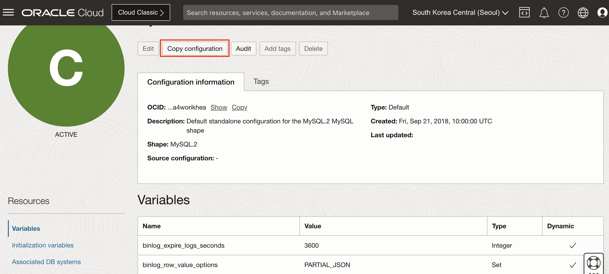
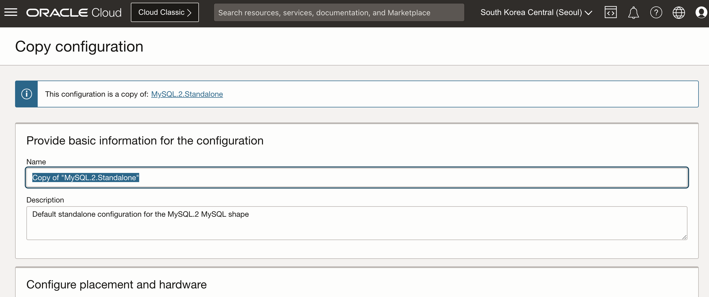
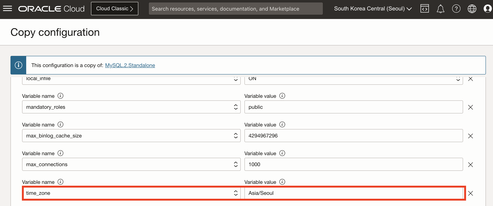
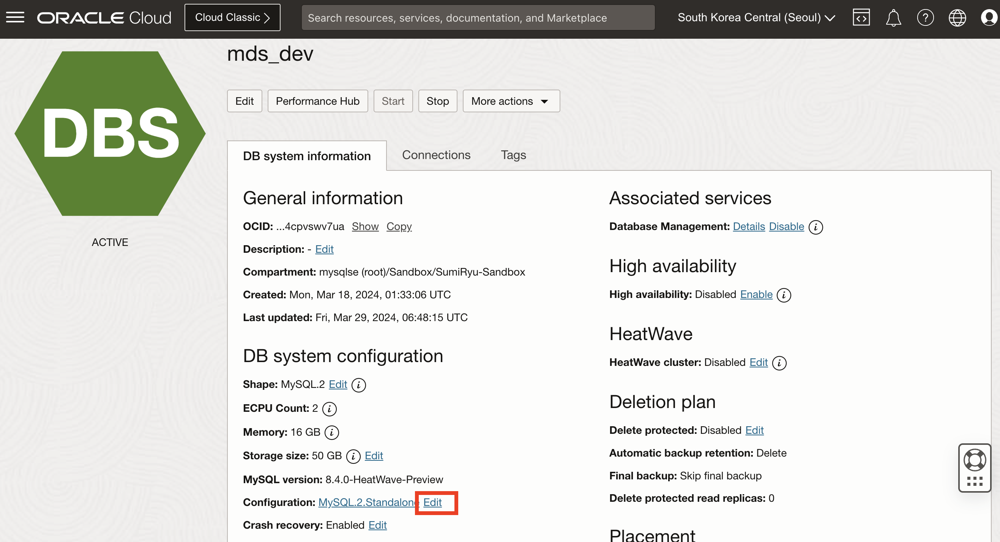
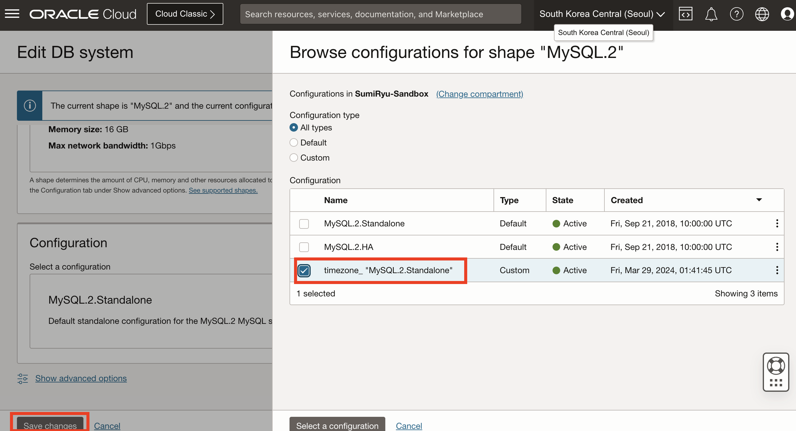

## MDS_timezone
How to set timezone on MDS 

MDS 에서 timezone 설정 방법

### 1. MDS Configuration 설정 화면에서 Configuration 생성 후 timezone 추가 (Create a new configuration and add timezone)
- MySQL HeatWave > Configurations > Configuration details
- MDS Configuration 설정 화면에서 기존의 Configuration을 복사해서 새로운 Configuration 생성 (Create a new configuration on Confiruation menu on MDS)

- 새로운 Configuration 이름을 입력 (Please give it a new name)

- 아래 User variables의 variable name 필드에 timezone 선택 후 variable value에 Asia/Seoul 입력 
(Create MySQL Configuration by selecting the system variable “time_zone”  and click on “Create”)

### 2. MDS 상세페이지에서 Configuration 수정

- MDS 상세페이지에서 Configuration 옆의 Edit 버튼 클릭 
(Click the Edit button on the detail page of MDS)

- Brows Configuration 팝업창에서 새로 만든 Configuration 선택 후 저장
(Select the new Configuration on the pop-up window and click the Save button)
 